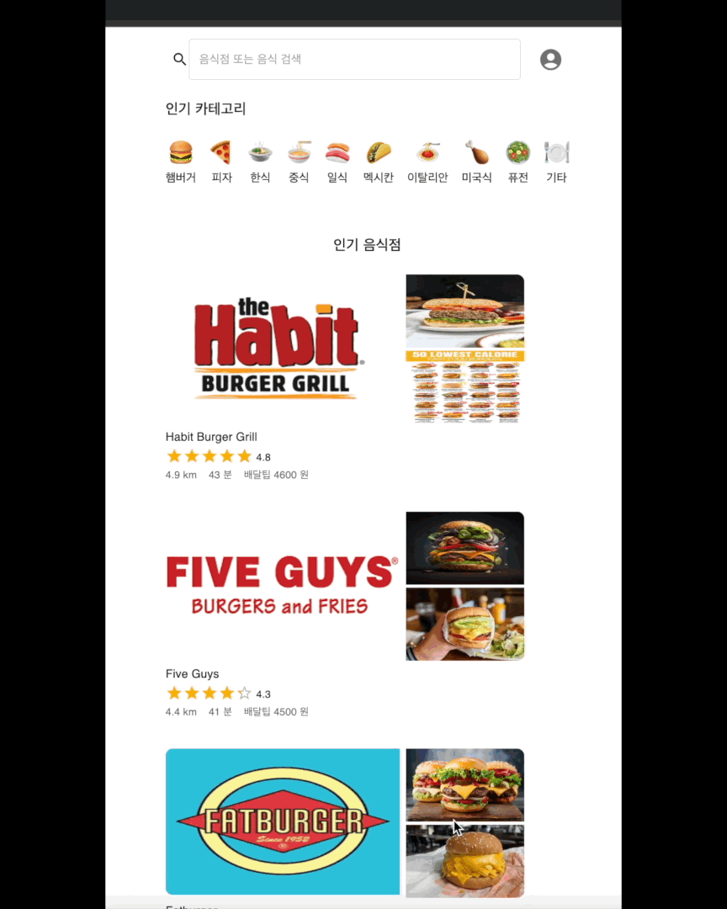
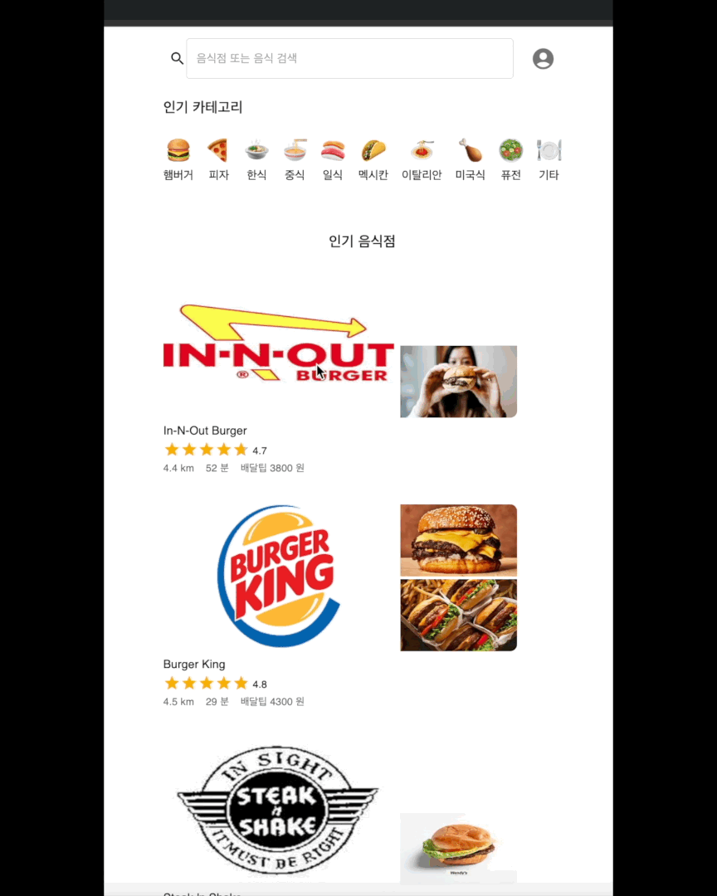
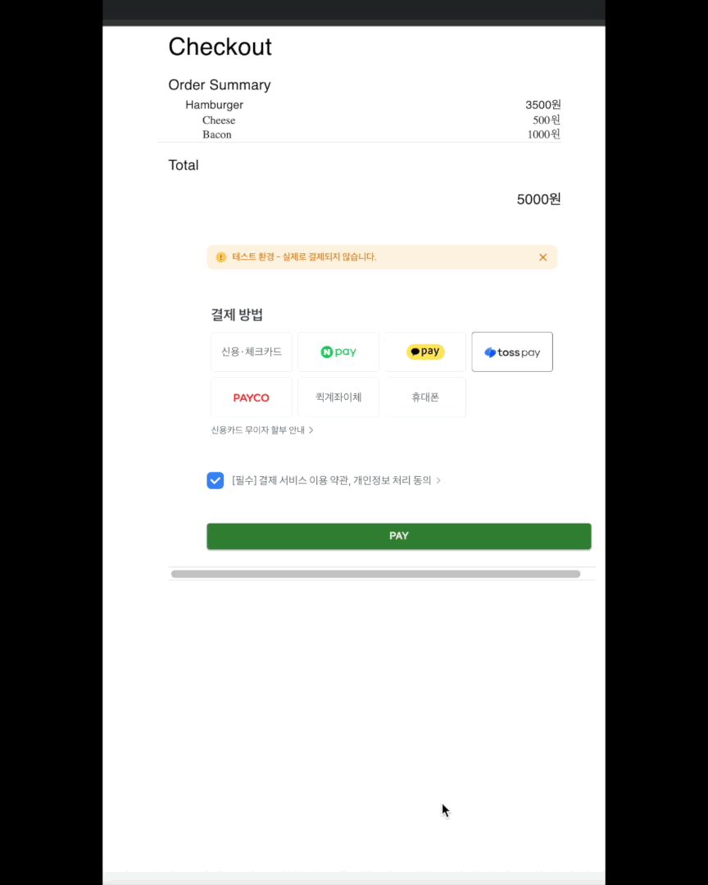
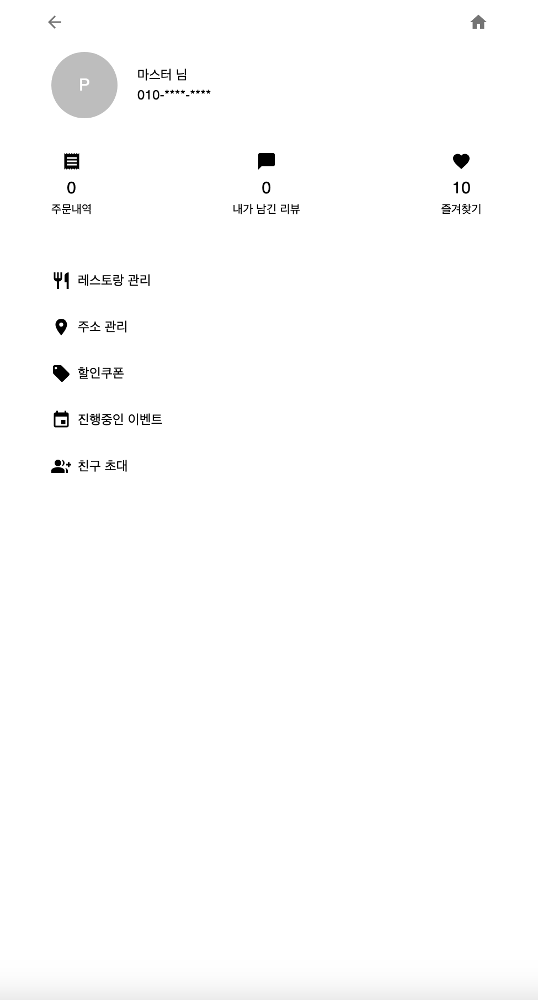
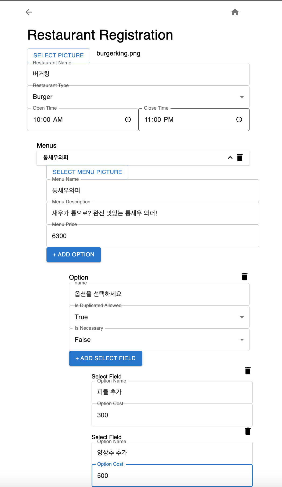
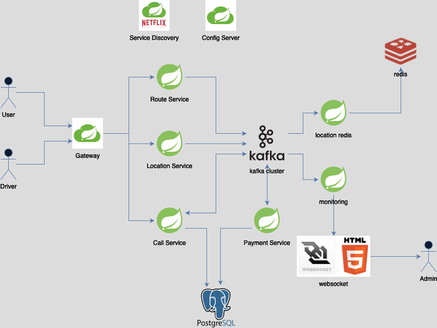
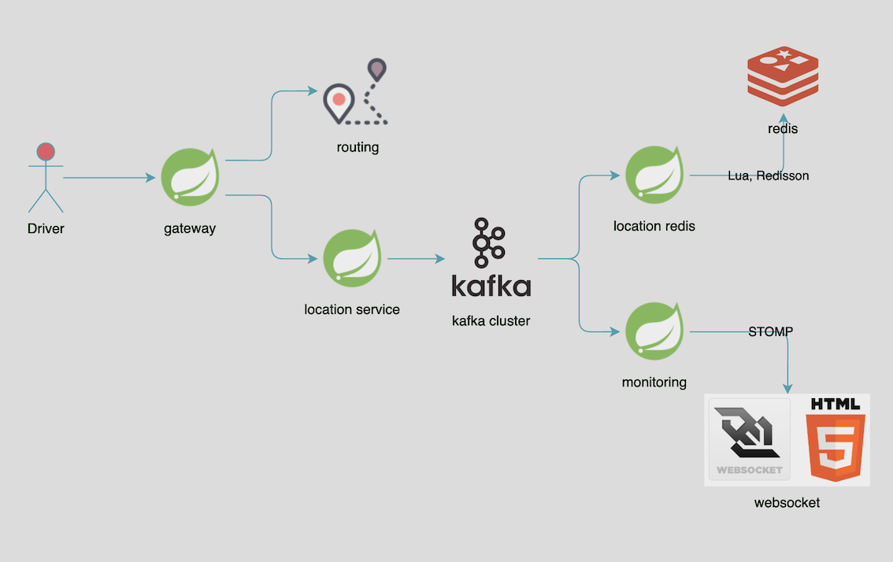
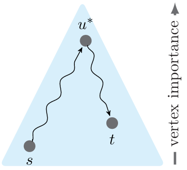
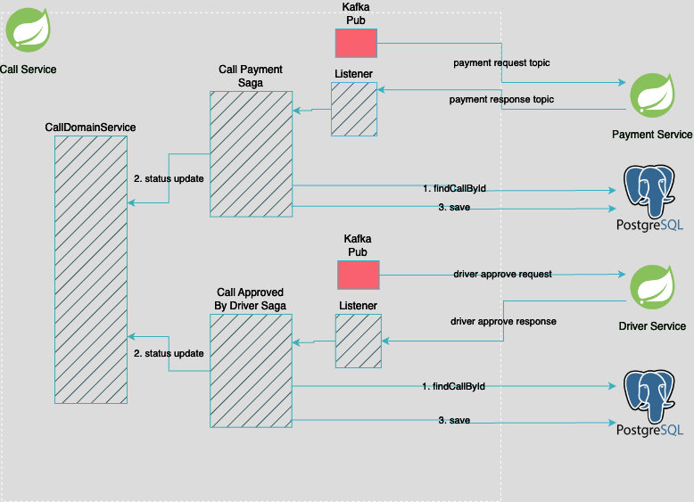
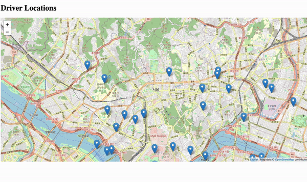

<div style="display: flex; justify-content: space-around; align-items: center; flex-wrap: wrap;">
  <div style="flex: 1; text-align: center; margin: 10px;">
    <h2>Food Delivery Service </h2>
    <br>
  </div>
</div>

###  Tech Stack
- - -
<p>
  &nbsp
  &nbsp
  &nbsp
  &nbsp
  &nbsp
  &nbsp
  &nbsp
</p>
   
### Sample Images 
- - -
<div style="display: flex; justify-content: space-around; align-items: center; flex-wrap: wrap;">
  <div style="flex: 1; text-align: center; margin: 10px;">
    <b>Category </b>
    <br>
    
  </div>

  <div style="flex: 1; text-align: center; margin: 10px;">
    <b>Search Bar</b>
    <br>
    
  </div>

  <div style="flex: 1; text-align: center; margin: 10px;">
    <b>Checkout</b>
    <br>
    
  </div>
</div>

<div style="display: flex; justify-content: space-around; align-items: center; flex-wrap: wrap;">
  <div style="flex: 1; text-align: center; margin: 10px;">
    <b>My Page</b>
    <br>
    
  </div>

  <div style="flex: 1; text-align: center; margin: 10px;">
    <b>Register Page</b>
    <br>
    
  </div>
  <div style="flex: 1; text-align: center; margin: 10px;">
  </div>
</div>


<p><br></p>  

### Frontend  
- - -
- 상태관리 redux

### Backend  
- - -    
- 레스토랑 등록, 검색, 주문
- unit, integration 테스트
- Selenium 구글 이미지 서치 크롤링 -> elastic search, postgresql 에 마이그레이션

### Infra
- Kubernetes, helm chart 로 마이크로 서비스 운영 및 배포

<p><br></p>   

### Taxi Call Service

<p>
<b>Overview</b>   
</p>

<p><br></p>

<p>
<b>Driver Location Streaming</b>
</p>
<p>1. Data Flow</p>



<p><br></p>

2. Routing Algorithm

- Contraction Hierarchy (CH)
- Open Source: Graphhopper



[Image Source](https://www.researchgate.net/figure/Illustrating-a-Contraction-Hierarchies-query_fig2_275279894)

<p><br></p>

<p>
<b> Domain Driven Design, Payment SAGA pattern </b> 
</p>


TODO

1. Outbox pattern with Debezium, Optimistic lock
2. Distributed Lock with 쿠폰 발급 시스템
3. Rollback entire call request on too late response from driver or payment
4. handle the duplicated different call request from a user

---  

### Simulation Test

- Multiple number of drivers
- Generated at Random Location
- code: [DriverSimulatorTest.java](driver/src/test/java/com/example/driver/DriverSimulatorTest.java)

### Realtime Monitoring View



- [simple websocket frontend](backend/monitoring/src/main/resources/templates/index.html)
- currently STOMP based
- Todo: RabbitMQ

---

### kube node environment setting

we need docker desktop and enable kubernetes

### build & run order

```shell
# all micorservices and obersavation apps
# docker image build with Google Jib added in pom.xml
<plugin>
    <groupId>com.google.cloud.tools</groupId>
    <artifactId>jib-maven-plugin</artifactId>
    <version>3.3.2</version>
    <configuration>
        <to>
            <image>lomojiki/uber-msa/${project.artifactId}:latest</image>
        </to>
    </configuration>
</plugin>

# for each microservices,
intellij tab maven -> select service -> Plugins -> jib -> jib:dockerBuild

# image name must be lomojiki/uber-msa/driver
# Pushing into hub fails if : lomojiki/uber-msa/driver
push images into hub with a docker desktop

# in values.yaml in each micro service
# default is IfNotPresent which will search on local image first and then remote.
# IfNotPresent vs Always
# https://stackoverflow.com/questions/74006353/difference-between-always-and-ifnotpresent-imagepullpolicy
image:
  repository: uber-msa/driver
  pullPolicy: IfNotPresent
  tag: ""
  
  
# helm build dependencies & install
cd environments
helm dependencies build prod-env
helm install <cluster-name> prod-env/ 
helm uninstall <cluster-name>

cd environment
helm install uber-msa /prod-env
```

<br/>

### Start order in local IDE environment for dev

1. configserver
2. eureka
3. micro services
4. gateway server
   <br/>

### Helm

<b> container ports </b>   

create new chart

```shell
helm create <chart-name>
```

eurekaserver: 8080
configserver: 8071   
gateway: 8072
driver: 8090
monitoring: 8091
route: 8075
user: 8077
driver-service: 8078
eatssearch: 8079


# port must be same.
# helm/.../user/values.yml
containerPort: 8077

service:
  type: ClusterIP
  port: 8077
  targetPort: 8077
---

### Kafka Module Architecture

<b>Dependencies</b>

- KafkaAdminClient, KafkaProducerConfig(KafkaTemplate) <- KafkaProducer/KafkaConsumer <- Apps
    - KafkaAdminClient contains `createTopic()`
    - KafkaProducer contains `onAppCreated(ApplicationStartedEvent)` EventListener, which microservice application's
      spring context will fire on their app started.
- KafkaConfigData <- Apps
    - configserver will feed config data into KafkaConfigData object.
    - because of `@ConfigurationProperties(prefix = "appname")`

---

### Note

Module   
`@ComponentScan(basePackages={"com.example"})` necessary to use shared classes.

```
// main pom.xml
// add new modules
    <modules>
        <module>kafka</module>
        <module>kafka/kafka-model</module>
        <module>kafka/kafka-admin</module>
        <module>kafka/kafka-config-data</module>
        ...
    </modules>
// sub modules kafka/pom.xml
    <parent>
        <artifactId>uber-msa</artifactId>
        <groupId>com.example</groupId>
        <version>0.0.1-SNAPSHOT</version>
    </parent>
    <artifactId>kafka</artifactId>
    
// sub-sub modules... kafka/kafka-model/.../pom.xml
    <parent>
        <artifactId>uber-msa</artifactId>
        <groupId>com.example</groupId>
        <version>0.0.1-SNAPSHOT</version>
        <relativePath>../../pom.xml</relativePath>
    </parent>
    <artifactId>kafka-model</artifactId>

```

Domain Driven Design

- Messaging To Dto
    - CallDataMapper

### Micro Service Setting

1. application apps

- pom.xml
    - spring cloud config client
    - eureka client
    - open feign
- application.yml
    - import config server url
    - eureka server url
    - actuator setting
- configserver/app-name.yml setting
- @ComponentScan in main() **Application.java
    - must include itself. no Error even though not included.
    - ``` 
  // com.example.monitoring
  @ComponentScan({"com.example.common.data",
  "com.example.common.config",
  "com.example.kafka.admin",
  "com.example.kafka.config.data",
  "com.example.kafkaconsumer",
  "com.example.monitoring"} )
    ```

2. gateway server

- route rules


