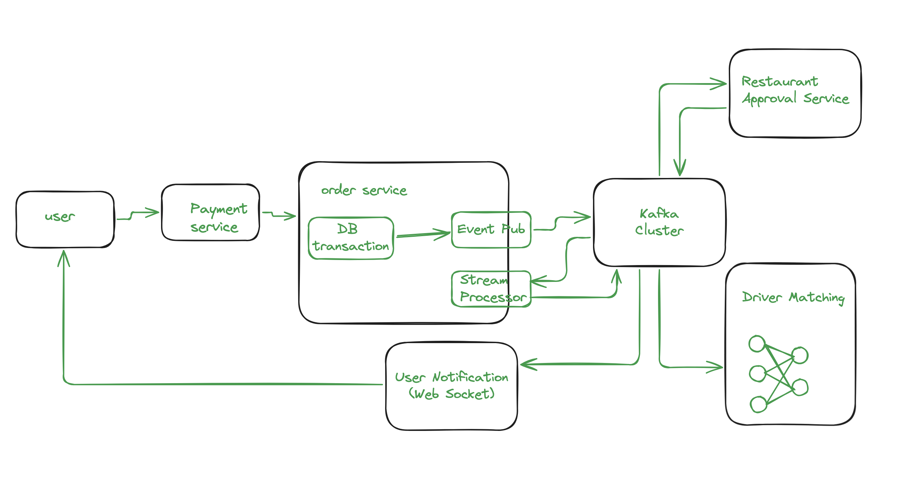

<h2 style="text-align: center;">Food Delivery Service </h2>

### Tech Stack

- - -
<p>
  &nbsp
  &nbsp
  &nbsp
  &nbsp
  &nbsp
  &nbsp
  &nbsp
</p>

### Sample Images

- - -
<table>
    <tr>
      <td style="text-align: center;"><b>Category</b></td>
      <td style="text-align: center;"><b>Search</b></td>
      <td style="text-align: center;"><b>Checkout</b></td>
    </tr>
    <tr>
        <td style="text-align: center;">    
          
        </td>
        <td style="text-align: center;">    
          
        </td>
        <td style="text-align: center;">  
          
        </td>
    </tr>
</table>
<table>
    <tr>
      <td style="text-align: center;"><b>My Page</b></td>
      <td style="text-align: center;"><b>Restaurant Registration</b></td>
      <td style="text-align: center;"><b></b></td>
    </tr>
    <tr>
        <td style="text-align: center;">    
          
        </td>
        <td style="text-align: center;">    
            
        </td>
        <td style="text-align: center;">    
        </td>
    </tr>
</table>


<p><br></p>  

### Architecture

- - -    

주문/결제 시스템  

- Transactional Outbox Pattern 으로 신뢰성 있는 카프카 메시지 전달.
- Reactive 기반 메시지 전송 및 backpressure 기능 구현 (Spring Cloud Stream). 
- 메시지 전송 Exactly Once Semantic 보장
    - idempotent kafka producer
    - TransactionalEventListener 로 database commit 후 메시지 전송.
    - read_committed kafka consumer
   
배달 기사 매칭 시스템 / 유저 알림 시스템
- 실시간 배달 기사 위치 redis 에 업데이트
- 주문 승인 이벤트 후 주문 사용자 그룹과 근처 배달기사들 그룹에 이분 매칭 수행
- jwt 기반 유저 인증, 주문 승인 되거나 배달 기사 매칭 된후 유저에게 알림

쿠폰 발행
- webflux 기반 서비스
- reliable kafka, idempotence producer(`acks=1`, `enable-idempotence: true`)
- rollback consumer (`enable-auto-commit: false`, manual kafka consumer's `commitSync`)
- redis 분산락 (`RLockReactive`)

카프카 클러스터  
- 1 주키퍼, 3 브로커, 1 스키마 레지스트리  

Elastic Search 간단한 메뉴 검색   

레스토랑 이미지 및 데이터 수집   
- Selenium 웹 크롤링

프론트엔드   
- OAuth2 로그인, 레스토랑 음식/옵션 선택, 장바구니, 토스페이 결제
- Redux 상태 관리/ thunk 기반 비동기 이벤트 처리

### Test
- BDD
- mocking (service, controller layer)
- test container
  - docker compose util: [DockerComposeStarter.java](backend/java/backend/common-util/src/main/java/com/example/commonutil/DockerComposeStarter.java)
    - customized docker compose runner
    - run like:
      - ```yaml
            dockerComposeStarter.startServiceAndWaitForLog("kafka-broker-1", ".*started.*", 5, TimeUnit.MINUTES);
            dockerComposeStarter.startServiceAndWaitForLog("kafka-broker-2", ".*started.*", 5, TimeUnit.MINUTES);
            dockerComposeStarter.startServiceAndWaitForLog("kafka-broker-3", ".*started.*", 5, TimeUnit.MINUTES);
          ```
    - example: [CouponControllerSimulationTest.java](backend/java/backend/coupon/coupon-app/src/test/java/com/example/couponapp/gatling/CouponControllerSimulationTest.java)

### Infra

- oauth2, resource server
- gateway filtering
- config server
- Eureka service discovery
- Kubernetes, helm chart 로 마이크로 서비스 운영 및 배포

<p><br></p>   

```yaml
gateway: 8080
eurekaserver: 8761
configserver: 8071   
eatsorderservice: 8074
user: 8077
driver-service: 8078
eatssearch: 8079
schema-registry: 8081
coupon-app: 8092
coupon-service: 8093
```


